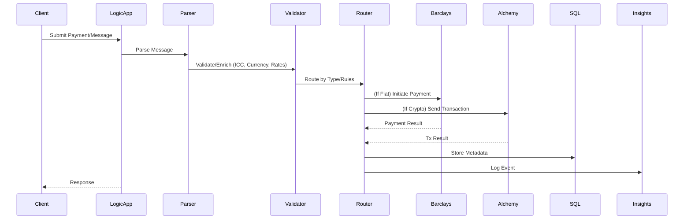

# Workflow & Architecture Overview

This document provides workflow diagrams, usage examples, API documentation, business logic, and recommendations for the ATIATO Translation System.

## System Architecture

```mermaid
flowchart TD
    A[Inbound Message] --> B(Logic App: Ingest & Validate)
    B --> C{Message Type?}
    C -- ISO 20022 --> D[Parse: ISO 20022]
    C -- SWIFT MT --> E[Parse: SWIFT MT]
    C -- ISO 8583 --> F[Parse: ISO 8583]
    D & E & F --> G[Enrich/Validate: ICC Rules, Currency, Rates]
    G --> H[Route: Point-to-Point or Multi-Point]
    H --> I[Outbound Message(s)]
    G --> J[Store Metadata/Settlement]
    J -->|SQL| K[(Azure SQL DB)]
    G -->|Key Vault| L[(Azure Key Vault)]
    G -->|Log| M[(App Insights/Log Analytics)]
    N -- Blockchain --> Q[Alchemy API]
    H --> O[Banking API (Barclays, etc.)]
```

## Business Logic: End-to-End Flow

1. **Ingest**: Logic App receives inbound message (API, file, or event trigger).
2. **Parse**: Message is parsed using the appropriate parser (ISO 20022, SWIFT MT, ISO 8583).
3. **Enrich/Validate**: ICC rules, currency registry, and exchange rates are applied. Metadata is validated against the JSON schema.
4. **Route**: Based on message type and metadata, route to blockchain (Alchemy) or banking (Barclays) rails.
5. **Execute**: Call the appropriate API (Alchemy for on-chain, Barclays for fiat) and handle response.
6. **Store/Log**: All transaction metadata and results are stored in Azure SQL and logged to Application Insights.

## Sequence Diagram: Payment Orchestration



## Usage Example: Deploy & Run

1. Deploy infrastructure (see main README):

   ```sh
   azd up
   ```

2. Add/modify Logic App workflows in `logic-apps/translation/`.
3. Use Azure Portal or Logic Apps Designer to configure triggers and actions.

## API Example: Custom Translation Endpoint

Suppose you deploy a custom API to App Service for advanced translation:

- **Endpoint:** `POST /api/translate`
- **Request Body:**

  ```json
  {
    "messageType": "ISO20022",
    "payload": { /* ... */ },
    "target": ["SWIFT_MT", "ISO_8583"]
  }
  ```

- **Response:**

  ```json
  {
    "results": [
      { "type": "SWIFT_MT", "payload": "..." },
      { "type": "ISO_8583", "payload": "..." }
    ],
    "status": "success"
  }
  ```

## Barclays Open Banking API Workflow

1. Obtain OAuth2 access token from Barclays
2. Initiate payment or fetch account info using the access token
3. Store and log all API interactions

## Alchemy Blockchain API Workflow

1. Connect to Alchemy endpoint for Ethereum or other EVM chain
2. Fetch on-chain data or submit transaction
3. Store and log all API interactions

## Recommendations for Additional Resources

### 1. **Banking API Integrations**

- Add modules for other Open Banking APIs (e.g., Plaid, Yodlee, TrueLayer, Open Bank Project)
- Implement PSD2-compliant flows for account info, payment initiation, and transaction history
- Use OAuth2 and consent management for secure access
- Document endpoints and required scopes for each provider

### 2. **Blockchain Integrations**

- Extend `alchemy_client.py` for other EVM-compatible chains (Polygon, BSC, etc.)
- Add modules for Bitcoin (e.g., Blockstream API), Ripple, Stellar, or other rails as needed
- Implement smart contract interaction templates

### 3. **Security & Compliance**

- Enforce strong input validation and output encoding
- Use Key Vault for all secrets and API keys
- Enable auditing and monitoring for all API calls
- Document data retention and privacy policies

### 4. **Testing & Monitoring**

- Add unit and integration tests for all modules
- Use Azure Monitor and Application Insights for end-to-end observability
- Document test cases and expected results

### 5. **Documentation & Developer Experience**

- Expand `README.md` and `modules/README.md` with full API usage, error handling, and troubleshooting
- Provide OpenAPI (Swagger) specs for all custom APIs
- Add code samples for all major flows (banking, blockchain, translation)

---
For further customization, add diagrams, sequence flows, or additional API examples as needed. For new banking or blockchain integrations, create a new module in `modules/` and document its usage in this file and in `modules/README.md`.
