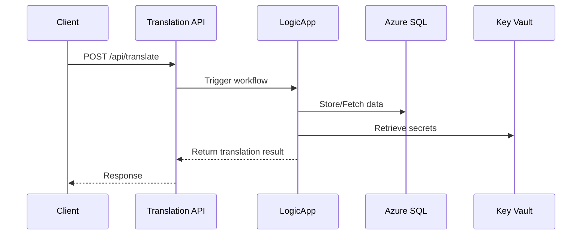
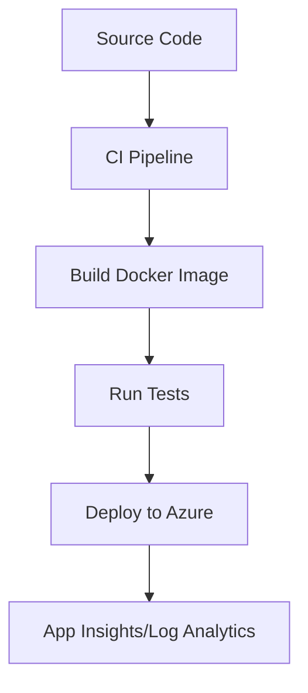
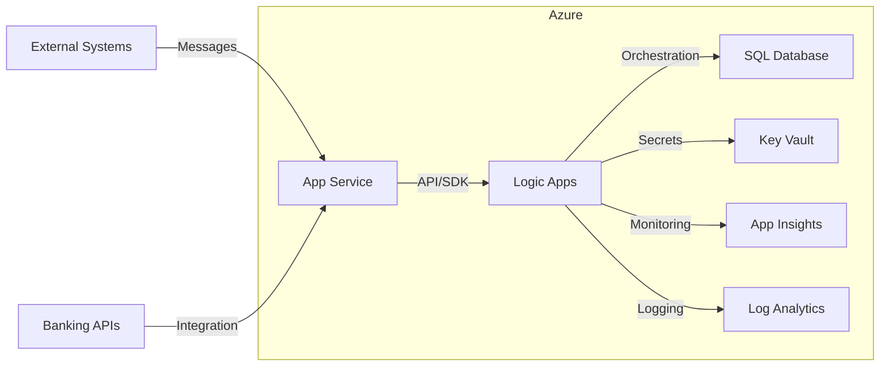

# ATIATO System Architecture

This document provides a comprehensive overview of the ATIATO translation system architecture, including process flow maps, deployment diagrams, integration points, and extensibility recommendations.

## Table of Contents

- [System Overview](#system-overview)
- [Process Flow Maps](#process-flow-maps)
- [Deployment Architecture](#deployment-architecture)
- [Integration Points](#integration-points)
- [Banking API Integration](banking_api_integration.md)
- [Extending Business Logic](#extending-business-logic)
- [References](#references)

## System Overview

ATIATO is a modular, Azure-native translation system for financial messaging, supporting:

- Point-to-point and point-to-multi-point flows
- Multi-standard message translation (ISO 20022, SWIFT MT, ISO 8583)
- Secure, compliant, and auditable operations

See the [README](../README.md) for a high-level summary.

## Process Flow Maps

### 1. End-to-End Message Processing

```mermaid
flowchart TD
    A[Inbound Message] --> B(Logic App: Ingest & Validate)
    B --> C{Message Type?}
    C -- ISO 20022 --> D[Parse: ISO 20022]
    C -- SWIFT MT --> E[Parse: SWIFT MT]
    C -- ISO 8583 --> F[Parse: ISO 8583]
    D & E & F --> G[Enrich/Validate: ICC Rules, Currency, Rates]
    G --> H[Route: Point-to-Point or Multi-Point]
    H --> I[Outbound Message(s)]
    G --> J[Store Metadata/Settlement]
    J -->|SQL| K[(Azure SQL DB)]
    G -->|Key Vault| L[(Azure Key Vault)]
    G -->|Log| M[(App Insights/Log Analytics)]
```

### 2. API Translation Flow



### 3. DevOps & Automation Pipeline



## Deployment Architecture



## Integration Points

- **App Service**: Hosts APIs and SDKs for message translation
- **Logic Apps**: Orchestrates message flows and business logic
- **SQL Database**: Stores balances, rates, registry, and message logs
- **Key Vault**: Manages secrets and credentials
- **App Insights/Log Analytics**: Monitoring and diagnostics
- **Docker Compose**: Local development and testing

## Extending Business Logic

- Add new message types by extending Logic App workflows and Python modules in `modules/`.
- Integrate additional banking APIs by following the patterns in [Banking API Integration](banking_api_integration.md).
- Implement advanced business rules (e.g., fraud checks, compliance validation) as Logic App actions or Python microservices.
- Use state diagrams to model new payment or settlement lifecycles.
- Document all new flows and logic in this `docs/` directory for maintainability.

## References

- [Project README](../README.md)
- [Docker Compose File](../docker-compose.yml)
- [Workflow Examples](../WORKFLOWS.md)
- [Banking API Integration](banking_api_integration.md)
