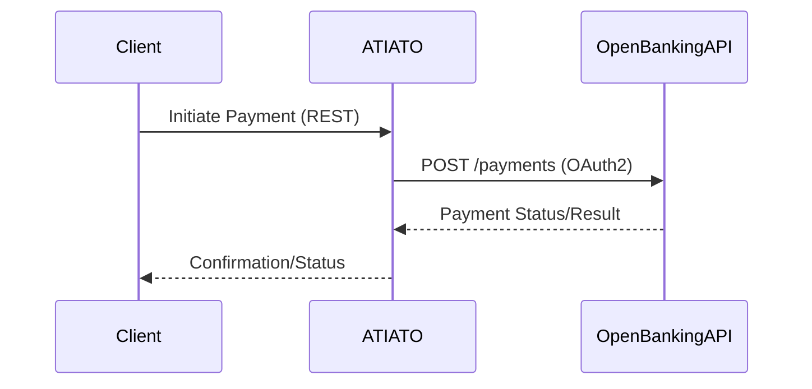
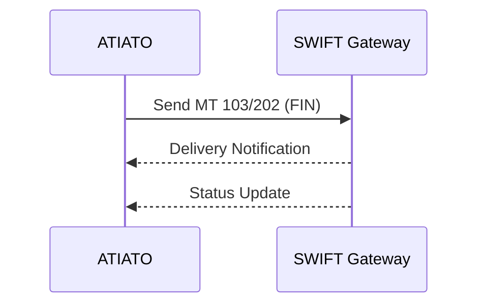
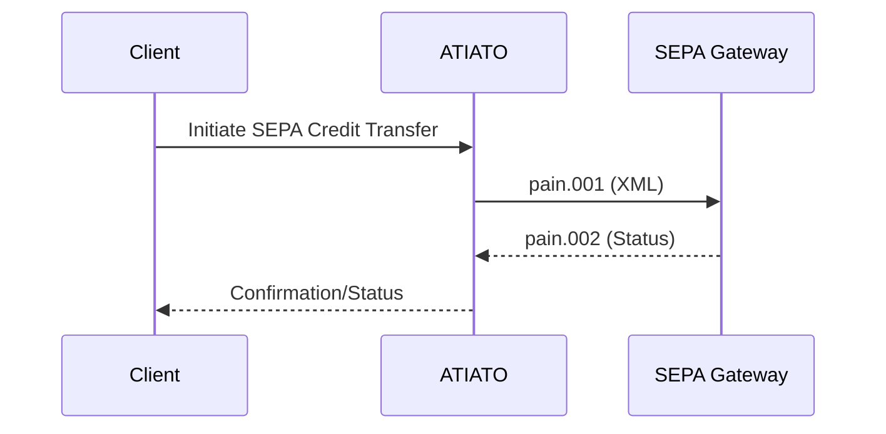
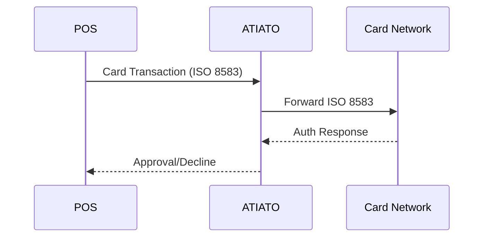
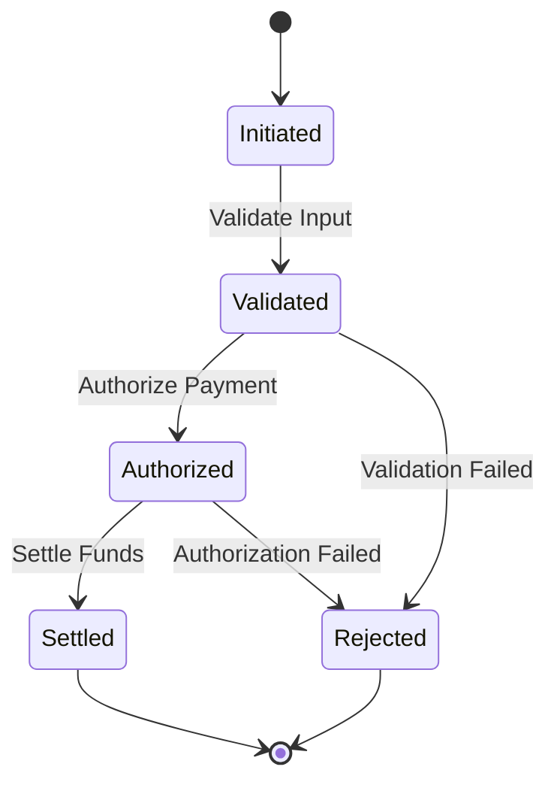
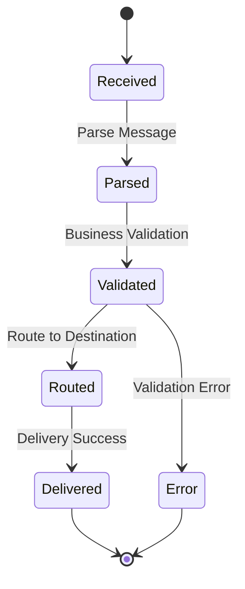

# Banking API Integration Flows

This document details recommended integration flows and state diagrams for connecting ATIATO to external banking APIs (e.g., Open Banking, SWIFT, SEPA, card networks).

## Table of Contents

- [Overview](#overview)
- [Open Banking API Flow](#open-banking-api-flow)
- [SWIFT Network Integration](#swift-network-integration)
- [SEPA Payment Flow](#sepa-payment-flow)
- [Card Network (ISO 8583) Flow](#card-network-iso-8583-flow)
- [State Diagrams](#state-diagrams)

## Overview

ATIATO supports modular integration with a variety of banking APIs and networks. Each integration can be implemented as a Logic App connector, Python SDK module, or external microservice.

## Open Banking API Flow

## SWIFT Network Integration

## SEPA Payment Flow

## Card Network (ISO 8583) Flow

## State Diagrams

### Payment Lifecycle State Diagram

### Message Processing State Diagram

---
For more, see [System Architecture](architecture.md) and [README](../README.md).
