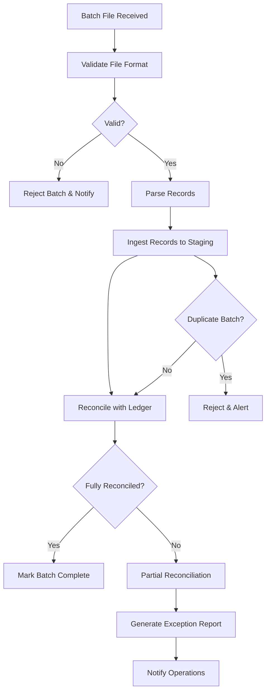
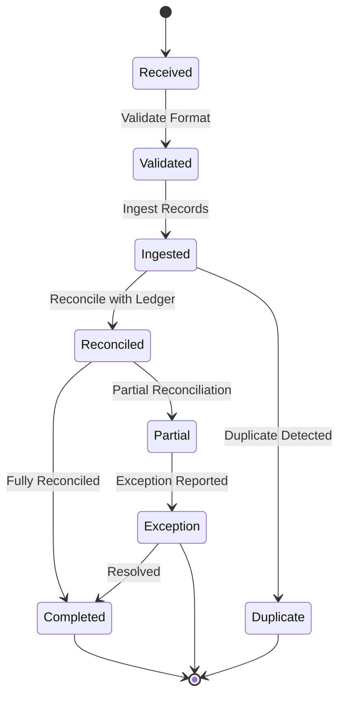

# Batch Processing & Reconciliation

This document details the batch file ingestion, reconciliation, and reporting flows for ATIATO, including non-typical scenarios such as partial reconciliation, duplicate batch detection, and exception reporting.

## Flowchart: Batch Processing

## State Diagram: Batch Lifecycle

---
For more, see [System Architecture](architecture.md).
