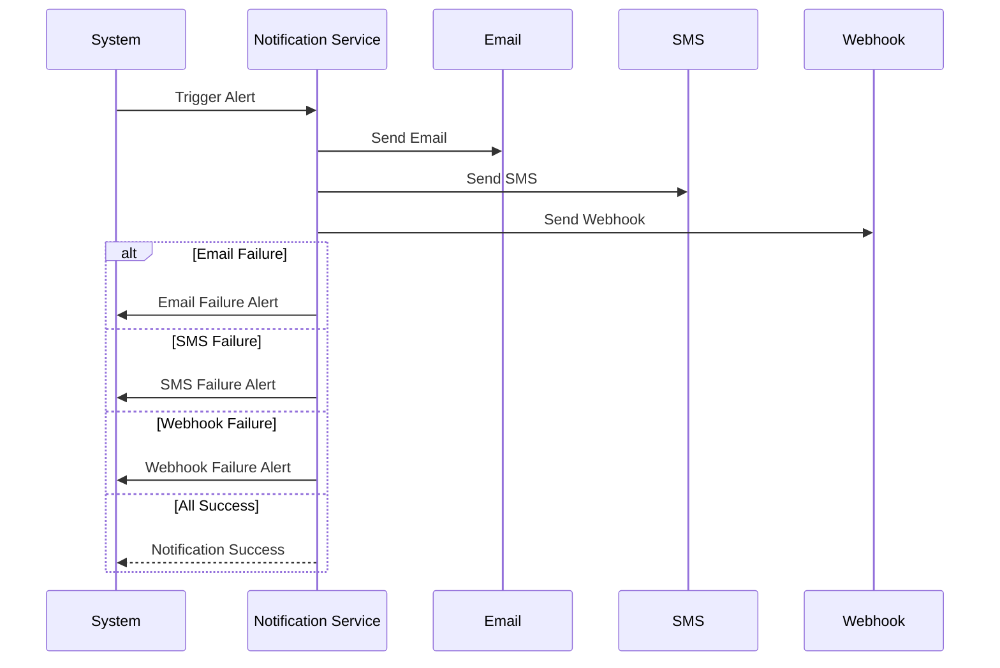
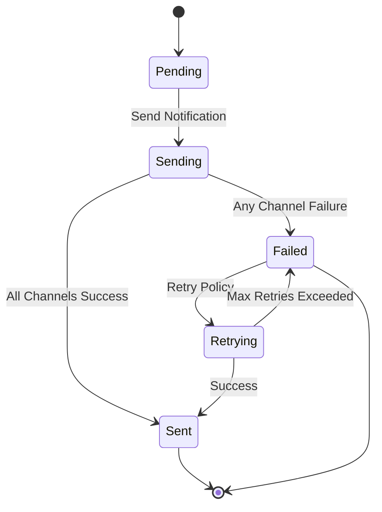

# Notification & Alerting Flows

This document details the notification and alerting flows for ATIATO, including non-typical scenarios such as multi-channel escalation, alert suppression, and notification failure handling.

## Sequence Diagram: Notification Flow

## State Diagram: Notification Lifecycle

---
For more, see [System Architecture](architecture.md).
