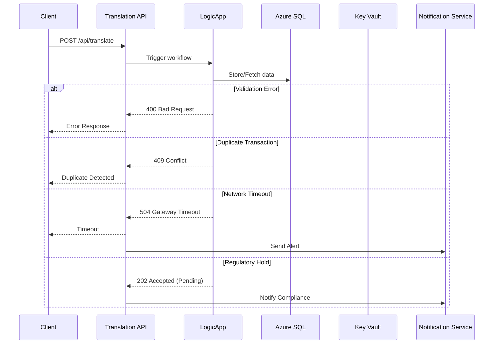
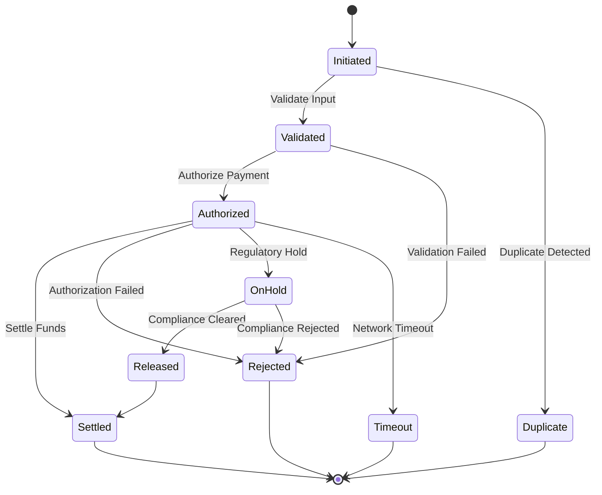

# Payment Exception Handling Flow

This document details the exception and error handling flows for payment processing in ATIATO, including non-typical scenarios such as network partition, duplicate detection, and regulatory holds.

## Sequence Diagram: Exception Handling

## State Diagram: Payment Exception States

---
For more, see [System Architecture](architecture.md).
