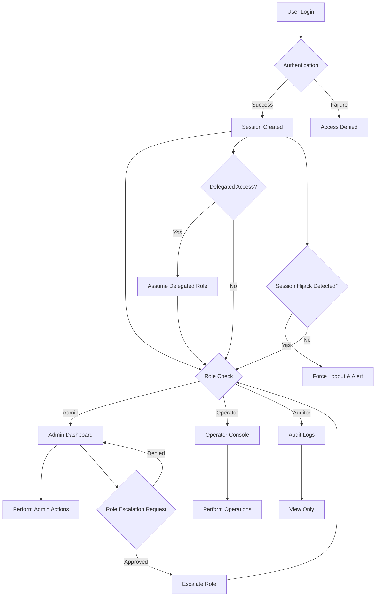
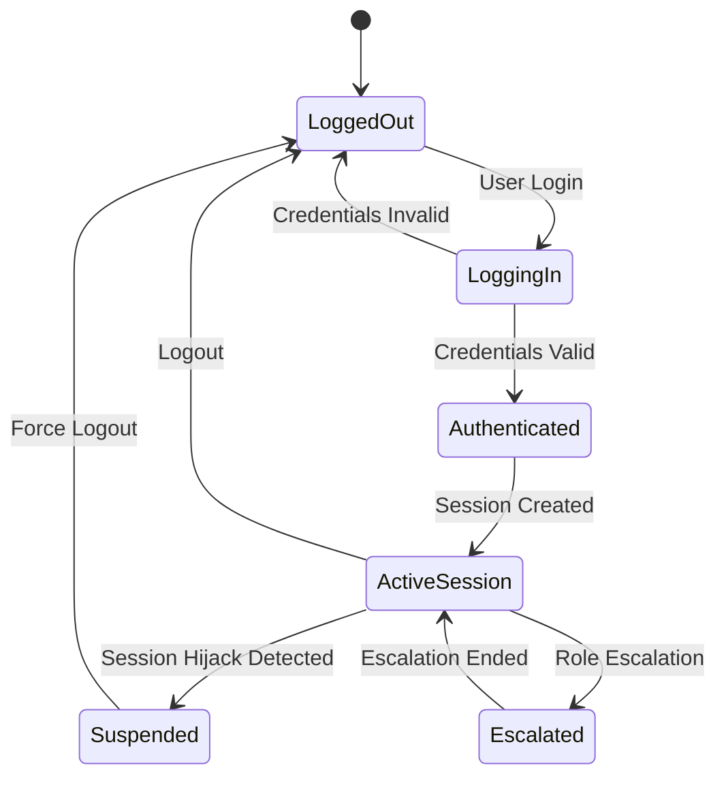

# User and Role Access Control

This document describes the authentication, authorization, and audit logging flows for ATIATO, including non-typical scenarios such as delegated access, session hijack detection, and role escalation.

## Flowchart: User Access Control

## State Diagram: Session Lifecycle

---
For more, see [System Architecture](architecture.md).
